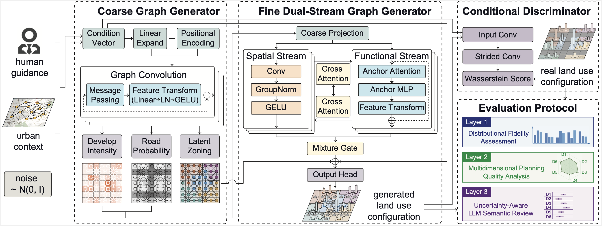

# HGGAN: A Hierarchical Graph Generative Adversarial Framework for Urban Land Use Planning

This repository contains the implementation of **HGGAN**, a hierarchical graph generative adversarial framework for instruction-guided urban land use planning. HGGAN formulates land use configuration as a conditional graph generation problem and adopts a coarse-to-fine architecture to jointly model local spatial structure and long-range functional dependencies.



## Overview

Urban land use planning requires balancing multiple and often competing objectives, including spatial accessibility, functional balance, environmental quality, and urban resilience. Existing deep generative approaches commonly represent urban layouts as raster grids and rely primarily on convolutional architectures. While effective at capturing local spatial regularity, these approaches provide limited support for modeling long-range relationships such as functional complementarity, transportation connectivity, and land use compatibility across distant locations. Evaluation presents a second challenge. Distributional similarity alone does not determine whether a generated plan is coherent from a planning perspective: two plans with similar land use proportions may differ substantially in spatial fragmentation, service accessibility, environmental exposure, functional balance, or resilience. 

HGGAN addresses these limitations through:

- **Region graph formulation** of urban land use configuration
- **Hierarchical coarse-to-fine generation** for macro-scale structure and detailed allocation
- **Dual-stream fine refinement** for local spatial regularity and long-range functional dependencies
- **Multi-objective training** integrating local, global, structural, and adversarial supervision
- **Comprehensive evaluation protocol** combining distributional metrics, interpretable planning indicators, and uncertainty-aware LLM assessment

## Main Ideas

### 1. Graph-native conditional urban planning
The target region is represented as a grid graph, where each cell is a node and node features represent POI composition. This lets the model explicitly capture non-local relationships through message passing instead of relying only on local convolutional texture.

### 2. Hierarchical generation
HGGAN uses a two-stage generator:

- **Coarse generator**: predicts macro-scale signals including development intensity, road probability, and latent zoning assignment
- **Fine generator**: transforms the coarse planning structure into detailed node-level land use distributions

### 3. Three-layer evaluation
The evaluation protocol combines three complementary views:

- **Distribution-based metrics** such as KL / JS / Hellinger / Cosine / Wasserstein distributional distances
- **Rule-based urban planning scores** summarized into 6 selected dimensions:
  - Spatial Coherence
  - Development Compactness
  - Healthy Environment
  - Land Use Balance
  - Community Convenience
  - Urban Resilience
- **Uncertainty-aware LLM evaluation** with repeated runs to quantify semantic assessment variability

## Data

The dataset is not included in this repository at current stage. A later update will provide the releasable data package and instructions for organization.

## Environment
A Conda environment specification is provided. A typical setup is:

```bash
conda create -n hggan python=3.10 -y
conda activate hggan
pip install -r requirements.txt
```

## Training

Example training command using the anchor-based functional stream:

```bash
python train.py \
  --data_dir ./data \
  --output_dir ./result/func_anchors \
  --func_backend anchors \
  --anchor_m 32 \
  --anchor_key_dim 32
```

The training stage optimizes the hierarchical generator together with the conditional adversarial objective and saves checkpoints under the specified output directory.

## Generation

After training, generate land use plans from a trained checkpoint:

```bash
python generate.py \
  --ckpt ./result/func_anchors/best_model.pt \
  --data_dir ./data \
  --out_npz ./result/func_anchors/generated/generated_testset.npz \
  --batch_size 8 \
  --func_mode cached
```

## Evaluation

### 1) Distributional fidelity and planning quality

```bash
python evaluate_generated_plans.py \
  --baseline_dir ./result \
  --models func_anchors \
  --data_dir ./data \
  --tag testset \
  --presence_mode argmax \
  --dimension_profile planning_6dimension \
  --do_quant \
  --save_all
```

This evaluates generated plans using the distributional metrics and six planning-quality dimensions described above.

### 2) Uncertainty-aware LLM evaluation

```bash
python robust_llm_evaluator.py \
  --provider gemini \
  --model gemini-2.5-pro \
  --generated_dir ./result/func_anchors/generated \
  --n_sample 30 \
  --n_runs 10 \
  --temperature 0.7 \
  --output ./result/llm_evaluation/gemini25pro_uncertainty.json \
  --verbose
```

This samples generated plans, evaluates each plan repeatedly, and aggregates dimension-level semantic scores, confidence values, and inter-run uncertainty.


